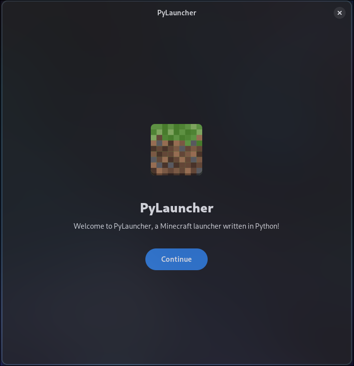
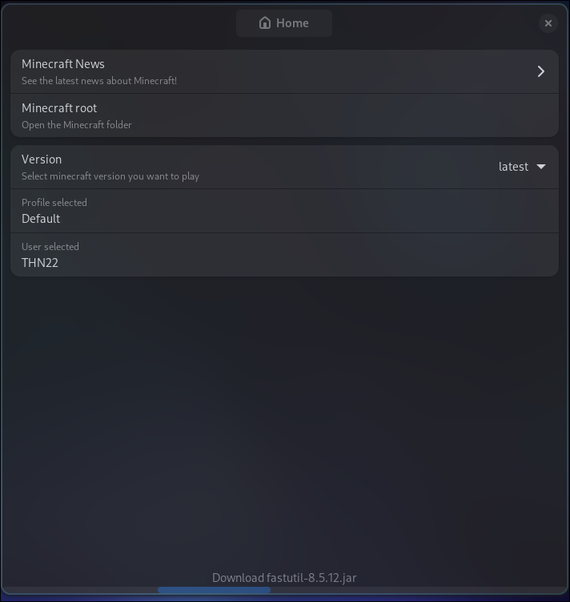
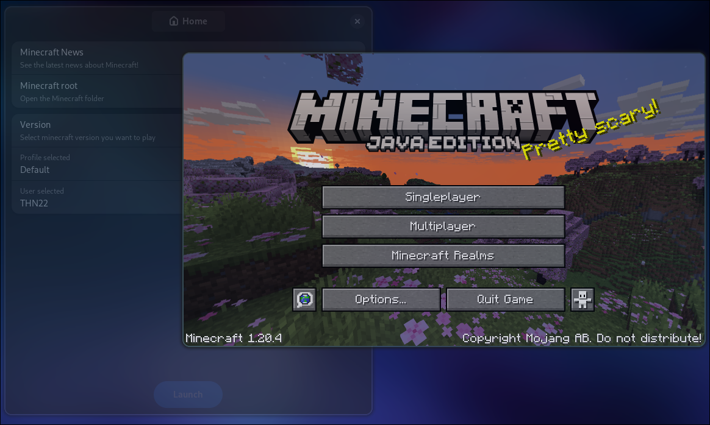

# PyLauncher
A minecraft launcher written in python and using Gtk 4 and libadwaita.
I write this launcher because i dont know a minecraft launcher made on python and with gtk/libadwaita, also i made it for fun.

The UI maybe doesn't follow the [GNOME Human Interface Guidelines](https://developer.gnome.org/hig/), but for me, it looks well.

### Requirements
- webkitgtk 
Arch Linux
`# pacman -S webkitgtk-6.0`

- All of the dependencies listed on requirements.txt
`$ pip install -r requirements.txt`

### Screenshots

